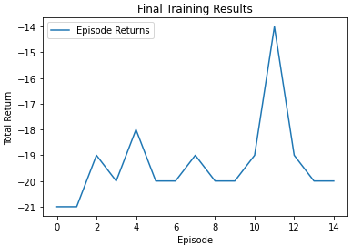

# Dueling DQN Agent for Pong (RAM-based)

This repository contains an implementation of a Dueling Deep Q-Network (Dueling DQN) agent trained to play Atari Pong using RAM state inputs from the `ALE/Pong-ram-v5` environment in Gymnasium. The agent uses Double DQN, experience replay, and epsilon-greedy action selection to stabilize learning.

## Objectives

- Implement a Dueling DQN architecture with separate value and advantage streams  
- Train the agent using Double DQN logic to reduce Q-value overestimation  
- Evaluate and visualize the agent playing Atari Pong using RAM inputs  
- Render and save gameplay using both `human` and `rgb_array` modes


## Sample Results

After training for 15 episodes:

```
Episode 1/3 - Total Reward: -15.0
Episode 2/3 - Total Reward: -16.0
Episode 3/3 - Total Reward: -14.0
```




## Contact

For any questions or collaboration opportunities, feel free to reach out at [hey@njoguevans.me](mailto:hey@njoguevans.me).
